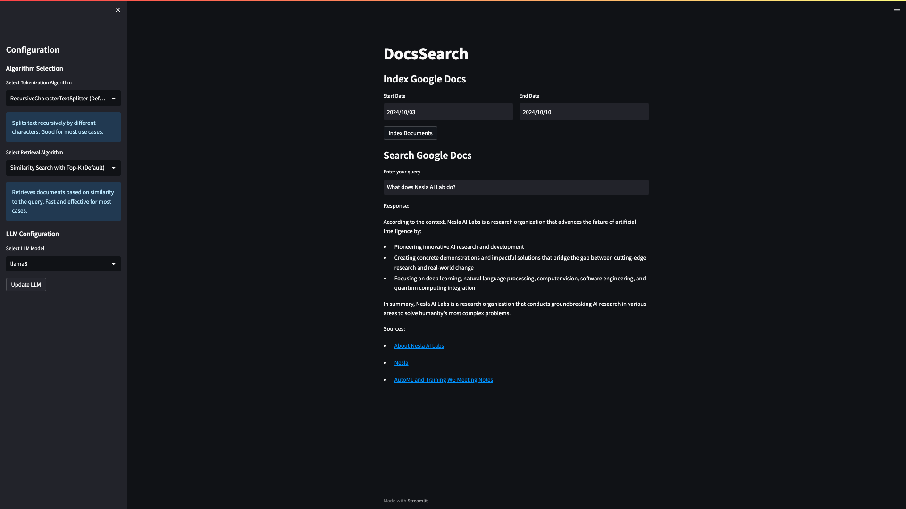

# DocsSearch

This open-source Python software allows users to search across their Google Docs files and get LLM-generated responses using a RAG (Retrieval-Augmented Generation) architecture. For privacy reasons, this was originally designed to be used with a local LLM model like Llama, but can also be configured to work with models from non-local providers such as OpenAI, Anthropic, or Google, providing flexibility in deployment options.

## Features

- Search across Google Docs files
- RAG architecture for intelligent responses
- Automatic indexing of new documents
- Vector storage using ChromaDB
- Configurable LLM (default: Llama3 via Ollama)
- Simple UI with Streamlit

## Architecture

The project is structured as follows:

```
google_docs_rag/
├── README.md
├── requirements.txt
├── .gitignore
├── .env
├── app.py
├── config.py
├── streamlit_app.py
└── backend/
    ├── __init__.py
    ├── google_docs.py
    ├── document_processor.py
    ├── vector_store.py
    ├── rag.py
    └── llm.py
```

- `app.py`: Main application logic
- `config.py`: Configuration settings
- `backend/`: Contains all backend logic
  - `google_docs.py`: Google Docs integration
  - `document_processor.py`: Document chunking and processing
  - `vector_store.py`: ChromaDB integration
  - `rag.py`: RAG implementation using Langchain
  - `llm.py`: LLM integration (default: Llama3 via Ollama)
- `streamlit_app.py`: Streamlit-based user interface

## Dependencies

- langchain
- chromadb
- google-auth
- google-auth-oauthlib
- google-auth-httplib2
- google-api-python-client
- streamlit
- python-dotenv

## Setup

1. Clone the repository:
   ```
   git clone https://github.com/phvash/google-docs-rag-search.git
   cd google-docs-rag-search
   ```

2. Create a virtual environment and activate it:
   ```
   python -m venv venv
   source venv/bin/activate  # On Windows, use `venv\Scripts\activate`
   ```

3. Install the required dependencies:
   ```
   pip install -r requirements.txt
   ```

4. Set up Google OAuth 2.0 credentials:
   - Go to the Google Cloud Console
   - Create a new project or select an existing one
   - Enable the Google Drive API and Google Docs API
   - Create OAuth 2.0 credentials (Desktop app)
   - Download the credentials and save them as `credentials.json` in the project root

5. Create a `.env` file in the project root and add your Google OAuth 2.0 credentials:
   ```
   GOOGLE_CLIENT_ID=your_client_id
   GOOGLE_CLIENT_SECRET=your_client_secret
   GOOGLE_REDIRECT_URI=http://localhost:8080/
   ```

6. Install and start Ollama (for Llama3 LLM):
   Follow the instructions at https://github.com/jmorganca/ollama to install Ollama and download the Llama3 model.

## Usage

1. Start the Streamlit app:
   ```
   streamlit run streamlit_app.py
   ```

2. Open your web browser and navigate to `http://localhost:8501`

3. Use the date range picker to index Google Docs for a specific period

4. Enter your query in the search box and get LLM-generated responses

5. Configure the LLM model using the sidebar options



## Contributing

Contributions are welcome! Please feel free to submit a Pull Request.

## License

This project is licensed under the MIT License.
